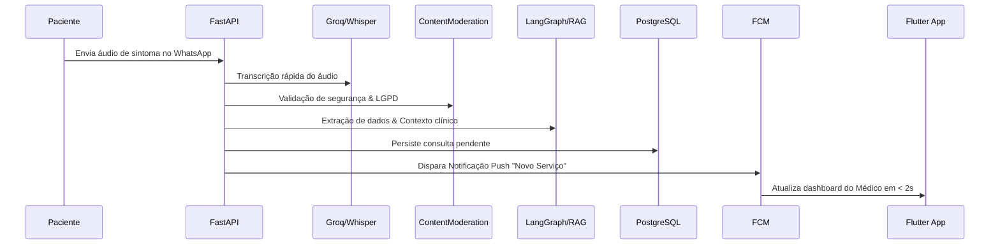

# 🚀 OmniConnect Technical Pitch Deck: Guia Completo & Estrutura de Slides

Este documento contém a estrutura detalhada de uma apresentação de negócios de alta densidade técnica (**Pitch Deck**) para o projeto **OmniConnect (Sua Consulta)**, voltada especificamente para investidores técnicos (Venture Capitalists, CTOs, Tech Partners). 

O material está dividido em duas partes principais:
1. **Guia Estruturado de Apresentação (Slides + Roteiro Técnico + Visual Recomendado)**
2. **Código-Fonte Marp (Markdown Presentation)** pronto para compilação automática em PDF/HTML.

---

# Parte 1: Estrutura dos Slides e Roteiro Técnico

## 📊 Metadados da Apresentação
* **Público-Alvo:** Investidores Anjo, VCs com tese em SaaS/Deep Tech, CTOs e Engenheiros de Software.
* **Tempo de Duração Estimado:** 10 minutos (Pitch) + 5 minutos (Perguntas e Respostas).
* **Foco Narrativo:** Como resolvemos um gargalo de mercado multibilionário (atendimento médico e de serviços) utilizando engenharia de software de ponta, IA Orquestrada autônoma, latência ultra-baixa (< 2s) e segurança de nível clínico.

---

### Slide 1: Abertura e Hook (O Paradigma da IA em Serviços de Alta Fricção)
* **Visual Recomendado:** Fundo escuro azul profundo (`#001D39`), tipografia premium em degradê azul-claro (`#7BBDE8` a `#BDD8E9`), logo minimalista do OmniConnect com efeito neon sutil.
* **Título:** **OmniConnect: Gestão Inteligente de Serviços Clínicos por IA Orquestrada**
* **Subtítulo:** *Automatizando o Ciclo de Atendimento Ponta a Ponta: do WhatsApp ao Prontuário em Tempo Real.*
* **Pontos de Destaque no Slide:**
  * SaaS de alta performance integrado com WhatsApp Business Cloud API e Flutter.
  * Orquestração autônoma multiagente (LangChain / LangGraph).
  * Latência de sincronização ponta a ponta inferior a 2 segundos.
* **Roteiro de Fala (Pitch Script):**
  > "Olá a todos. Hoje vim lhes apresentar a OmniConnect. No mercado de clínicas e serviços premium, o ativo mais precioso é o tempo dos profissionais e a experiência dos clientes. No entanto, o atendimento ainda é um caos analógico ou semi-automatizado via WhatsApp. Nós transformamos o WhatsApp em um canal de triagem inteligente, extração clínica automatizada e gestão transacional, sincronizado em tempo real com um ecossistema nativo em Flutter. Tudo isso sem intervenção humana, reduzindo custos operacionais de secretariado em até 70% e eliminando a perda de leads."

---

### Slide 2: O Problema (Caos Operacional e Fricção de Aquisição)
* **Visual Recomendado:** Cores de contraste forte, ícone de relógio correndo e linhas de fluxo quebradas em vermelho de alerta (`#EF4444`).
* **Título:** **O Gargalo da Comunicação e Gestão de Serviços**
* **Pontos de Destaque no Slide:**
  * **Fricção na Aquisição:** Clientes exigem instantaneidade pelo WhatsApp, mas dados se perdem em chats informais e não estruturados.
  * **Invisibilidade Operacional:** Prestadores não controlam a agenda dinamicamente; pacientes não possuem histórico consolidado.
  * **Perda Financeira:** Alta taxa de *no-show* (cancelamentos sem aviso) e overhead administrativo insustentável.
* **Roteiro de Fala (Pitch Script):**
  > "O problema central que resolvemos é duplo: a fricção de atendimento e a perda de dados. O cliente quer interagir de forma humana e rápida no WhatsApp. Mas para o médico, isso se traduz em um celular bagunçado, dados cruciais que se perdem no histórico e uma secretária sobrecarregada tentando transcrever exames e organizar agendas. A consequência direta é o cancelamento de consultas, a perda de dados financeiros e a insatisfação do paciente, que se sente desassistido."

---

### Slide 3: A Solução (A Ponte Inteligente OmniConnect)
* **Visual Recomendado:** Layout em duas colunas demonstrando o fluxo: WhatsApp (Cliente) $\rightarrow$ IA Cloud $\rightarrow$ App Flutter (Médico e Cliente) com estética de vidro transparente (Glassmorphism).
* **Título:** **OmniConnect: A Ponte entre a Conversa e a Transação**
* **Pontos de Destaque no Slide:**
  * **Triagem Autônoma no WhatsApp:** Um assistente inteligente (Isis IA) que extrai sintomas, checa planos de saúde e agendas.
  * **Sincronização em Tempo Real (< 2s):** Webhooks de alta velocidade atualizam a dashboard do prestador instantaneamente.
  * **App Flutter Dual-Profile:**
    * *Perfil Cliente (Paciente):* Acompanhamento, upload de exames, histórico e telemedicina.
    * *Perfil Fornecedor (Médico):* Agenda inteligente, controle de estoque, faturamento e CRM Clínico.
* **Roteiro de Fala (Pitch Script):**
  > "Nossa solução, o OmniConnect, é um ecossistema integrado. O paciente inicia o contato pelo WhatsApp. A nossa IA (Isis) realiza a triagem clínica preliminar, extrai os dados relevantes, confere a agenda e os convênios e envia as informações estruturadas. Em menos de 2 segundos, a consulta pendente aparece na dashboard do app Flutter do médico com notificações push automáticas via Firebase Cloud Messaging. O médico apenas confirma com um toque, e o paciente recebe o aviso no celular."

---

### Slide 4: A Arquitetura Técnica do Sistema
* **Visual Recomendado:** Diagrama de blocos de alta qualidade mostrando o fluxo de dados do cliente até o banco de dados e notificação.
* **Título:** **Arquitetura de Alta Performance e Baixa Latência**
* **Pontos de Destaque no Slide:**
  * **Frontend:** Flutter Mobile/Web (Material 3, Clean UI, Glassmorphism, temas HSL customizados).
  * **Backend API:** FastAPI (Python) rodando de forma assíncrona, garantindo alta concorrência e processamento rápido.
  * **Database & Vector Search:** PostgreSQL (armazenamento transacional estruturado) integrado a um Vector DB para recuperação de contexto.
  * **Push & Real-time:** Firebase Cloud Messaging (FCM) e Webhook Handlers otimizados.
* **Roteiro de Fala (Pitch Script):**
  > "Para os investidores técnicos, nossa pilha arquitetural foi desenhada para escalabilidade horizontal e latência crítica de sub-segundo. O frontend é construído em Flutter sob a especificação Material 3 com nosso próprio Design System unificado. O backend utiliza FastAPI assíncrono para lidar com centenas de requisições de webhooks concorrentes por segundo. O armazenamento transacional baseia-se em PostgreSQL, permitindo integridade referencial rígida, enquanto a indexação e busca vetorial de documentos técnicos e FAQs garantem que a IA responda sempre com precisão cirúrgica."

---

### Slide 5: O Cérebro: LangChain, RAG e Anti-Alucinação
* **Visual Recomendado:** Esquema ilustrativo do fluxo de RAG (Retrieval-Augmented Generation) com vetorização de documentos e recuperação de contexto em tempo real.
* **Título:** **IA Contextual RAG e Lógica Conversacional**
* **Pontos de Destaque no Slide:**
  * **LangChain / LangGraph Orchestration:** Lógica conversacional estruturada baseada em estado para garantir fluxos lineares e sem swap de personas.
  * **RAG Pipeline:** Indexação de documentos de saúde, regras de clínicas e manuais para respostas 100% embasadas.
  * **Protocolo Anti-Alucinação de Sessão:** Limpeza inteligente do estado de memória (MemorySaver) baseada no parâmetro `new_session: true` vindo do app.
  * **Fast-Track de Saudação:** Resposta fixa local instantânea para interações triviais, reduzindo custos de API e latência da LLM a zero.
* **Roteiro de Fala (Pitch Script):**
  > "Nossa IA não alucina. Nós implementamos um pipeline RAG robusto com LangChain e LangGraph, garantindo que o assistente Isis saiba exatamente que é uma paciente simulada ou assistente de triagem, sem misturar os papéis com o médico. Para evitar o clássico problema de 'histórico sujo' quando a página do app é recarregada, desenvolvemos um Protocolo Anti-Alucinação: o Flutter envia a flag 'new_session', limpando retroativamente a memória no backend antes de processar. Além disso, criamos um Fast-Track de Saudação com latência zero, contornando a chamada da LLM para mensagens triviais de boas-vindas."

---

### Slide 6: Moderação de Segurança e Guardrails (Lógica de Tolerância Zero)
* **Visual Recomendado:** Selo de segurança cibernética, escudo protetor e representação de filtragem de dados.
* **Título:** **Segurança e Moderação Baseada em IA Multimodal**
* **Pontos de Destaque no Slide:**
  * **Filtros Multimodais Avançados:** Interceptação em tempo real (Llama-3.3-70B e Llama-Vision-11B) de textos, áudios, PDFs e imagens.
  * **Tolerância Zero:** Bloqueio e mascaramento imediato de pornografia, discurso de ódio, golpes e CSAM.
  * **Exceções Clínicas Dinâmicas:** Liberação automática de termos médicos normais e fotos dermatológicas (lesões, exames) para diagnóstico legítimo.
  * **Mascaramento no Banco de Dados:** Mensagens censuradas são salvas como `[MENSAGEM BLOQUEADA PELO FILTRO DE SEGURANÇA]` para conformidade com a LGPD.
* **Roteiro de Fala (Pitch Script):**
  > "Segurança de dados e conformidade com a LGPD são inegociáveis na saúde. Implementamos um Content Moderation Service multimodal avançado. Se um usuário enviar uma imagem inadequada ou texto tóxico, o sistema intercepta antes de salvar no disco, mascara a mensagem no PostgreSQL como 'MENSAGEM BLOQUEADA' e devolve um aviso de segurança amigável. Contudo, nossa IA possui sensibilidade clínica: ela sabe diferenciar uma foto inadequada de uma imagem dermatológica real ou um termo anatômico legítimo, garantindo que a triagem médica continue fluindo perfeitamente."

---

### Slide 7: Nosso Diferencial de IP: Time de Desenvolvimento Multiagente
* **Visual Recomendado:** Rede neural de agentes especializados conectados (`database`, `backend`, `frontend`, `rag`, `qa`), mostrando a automatização do ciclo de desenvolvimento do software.
* **Título:** **Desenvolvimento Acelerado por Orquestração Multiagente**
* **Pontos de Destaque no Slide:**
  * **Orquestrador Central (`orchestrate-omniconnect.md`):** Um gerente autônomo baseado em IA que decompõe tarefas e despacha para especialistas.
  * **Registry de Agentes Especialistas:** Agentes dedicados para API (FastAPI), Banco de Dados, RAG (LangChain), QA (Testes automatizados) e UX.
  * **Sprint-Oriented Execution:** Progresso semanal estruturado com validação de contratos de saída e políticas de retry (3 tentativas com contexto de erro).
  * **Zero Overhead de Setup:** Escalabilidade de desenvolvimento onde novas competências são adicionadas via arquivos Markdown declarativos.
* **Roteiro de Fala (Pitch Script):**
  > "O nosso maior diferencial tecnológico (IP) está na forma como construímos e evoluímos a OmniConnect. Nós criamos um Orquestrador Multiagente interno. A partir de diretrizes técnicas declaradas em markdown, um roteador de IA distribui tarefas, mapeia dependências e aciona engenheiros de IA dedicados para codificar o backend, criar os schemas do banco, programar as telas no Flutter, realizar testes unitários e revisar o código. Isso nos permite escalar novos recursos a uma velocidade 5 vezes maior que uma equipe tradicional de desenvolvimento, reduzindo drasticamente nosso custo de engenharia de software."

---

### Slide 8: O Produto na Prática: Interface Premium (Design System)
* **Visual Recomendado:** Mockups do Flutter App no celular com estética de vidro (Glassmorphism), cores primárias em tons de azul e tags coloridas de status.
* **Título:** **Interface Premium e UX Focada no Profissional**
* **Pontos de Destaque no Slide:**
  * **Design System Clean UI:** Paleta de azuis sofisticada (`#001D39` a `#BDD8E9`), bordas arredondadas e suavidade visual extrema.
  * **Dashboard Inteligente (Médico):** Agenda fluida Material 3, controle de faturamento consolidado por mês/tipo de serviço, e KPIs automatizados de tempo ocioso.
  * **CRM Clínico e Triagem:** Histórico completo de conversas do paciente, exames médicos parseados estruturadamente por visão computacional.
* **Roteiro de Fala (Pitch Script):**
  > "O médico não quer lidar com softwares complexos; ele quer uma agenda organizada, controle de faturamento claro e zero dor de cabeça. Nós criamos uma interface minimalista seguindo conceitos de Clean UI e Glassmorphism em Flutter. O aplicativo Sua Consulta oferece ao médico uma tela onde os atendimentos triados pela IA chegam com tags de prioridade e exames pré-processados. Nosso Design System unificado garante que toda a interação no app seja suave e acessível para qualquer usuário leigo, acelerando a adoção do produto nas clínicas."

---

### Slide 9: O Fluxo de Dados Ponta a Ponta (Sequência Técnica)
* **Visual Recomendado:** Diagrama de sequência limpo e direto mostrando o percurso da mensagem (representado abaixo em texto).
* **Título:** **Fluxo Transacional de Ponta a Ponta**
* **Pontos de Destaque no Slide:**
  1. *Entrada:* Paciente envia mensagem/áudio no WhatsApp $\rightarrow$ Webhook do FastAPI recebe.
  2. *Processamento:* Transcrição via Groq/Whisper $\rightarrow$ Roteamento e Moderação de Segurança $\rightarrow$ Recuperação RAG.
  3. *Ação:* Atualização do PostgreSQL $\rightarrow$ Push Notification via FCM.
  4. *Visualização:* Dashboard do médico no Flutter é atualizada instantaneamente.
* **Roteiro de Fala (Pitch Script):**
  > "Vejam o fluxo em tempo de execução: o paciente envia um áudio descrevendo um sintoma no WhatsApp. O webhook assíncrono do FastAPI recebe o arquivo de áudio, transcreve em milissegundos via Groq/Whisper e processa o texto. A nossa moderação avalia a segurança, e o RAG local extrai a intenção do paciente. O banco de dados PostgreSQL é atualizado com o novo agendamento pendente e o Firebase envia uma notificação instantânea para o celular do médico. Todo esse pipeline complexo de IA e infraestrutura roda abaixo de 2 segundos."

---

### Slide 10: Oportunidade de Mercado, Roadmap e Escalabilidade
* **Visual Recomendado:** Gráfico de crescimento de mercado e ícones do roadmap futuro (Telemedicina, Multi-Clínicas, Integração com Labs).
* **Título:** **Escalabilidade, Mercado e Futuro do Produto**
* **Pontos de Destaque no Slide:**
  * **TAM (Total Addressable Market):** Mais de 500 mil médicos ativos apenas no Brasil; mercado de SaaS para saúde crescendo 18% ao ano.
  * **Roadmap do Produto:**
    * *Q3/2026:* Integração nativa com grandes laboratórios (Fleury, DASA) para carregamento automático de laudos.
    * *Q4/2026:* Telemedicina integrada direto no Flutter App com IA gerando resumos de prontuário pós-consulta.
    * *Q1/2027:* Gestão de franquias médicas (Multi-Clínicas) com controle administrativo centralizado.
* **Roteiro de Fala (Pitch Script):**
  > "Nossa oportunidade de mercado é massiva. Com mais de 500 mil médicos ativos no país, o mercado de SaaS de saúde está maduro para soluções orientadas a IA. O roadmap técnico do OmniConnect está desenhado para ir muito além de agendamentos. No próximo trimestre, integraremos nossa API diretamente aos sistemas dos grandes laboratórios de exames clínicos, permitindo que a IA importe e analise os laudos médicos automaticamente. No final do ano, lançaremos nossa ferramenta nativa de telemedicina, onde a IA ouve a consulta de vídeo e digita o prontuário para o médico em tempo real, em conformidade com as regras da LGPD e do CFM."

---

### Slide 11: A Proposta e Captação de Recursos
* **Visual Recomendado:** Gráficos circulares limpos mostrando a alocação de fundos, com cores primárias e marcantes.
* **Título:** **Captação: Acelerando o Desenvolvimento e Distribuição**
* **Pontos de Destaque no Slide:**
  * **Rodada Pre-Seed:** Captação de R$ 1.5 Milhão por 10% de Equity.
  * **Alocação de Recursos:**
    * **60% Engenharia de Produto e IA:** Refinamento dos pipelines multiagente e novos pipelines multimodais.
    * **25% Go-To-Market & Vendas:** Aquisição de clientes em clínicas médicas premium.
    * **15% Legal & Compliance:** Certificação de segurança e LGPD clínica.
* **Roteiro de Fala (Pitch Script):**
  > "Para acelerar esta visão, estamos abrindo nossa rodada Pre-Seed de 1,5 milhão de reais. Alocaremos 60% desse valor na contratação de engenheiros seniores de IA e mobile para expandir nossas ferramentas proprietárias de automação de desenvolvimento multiagente e nosso pipeline de visão computacional para exames. 25% serão destinados para nosso Go-To-Market em clínicas premium e os 15% restantes garantirão a blindagem jurídica e conformidade regulatória. Convidamos vocês a se juntarem a nós na transformação da gestão de saúde através da IA orquestrada."

---

### Slide 12: Encerramento e Perguntas (Q&A)
* **Visual Recomendado:** Layout elegante com dados de contato, QR Code direcionando para o site institucional ou demo funcional, e fundo escuro profissional.
* **Título:** **OmniConnect: O Futuro da Gestão de Serviços**
* **Pontos de Destaque no Slide:**
  * **Contato:** contato@omniconnect.com.br / +55 (11) 99999-9999
  * **Demo:** [Acesse o Simulador Web do App](file:///c:/Programacao/Alpha/Desafio_final_Flutter/docs/guia_uso_agentes.md)
  * *Perguntas e Respostas / Q&A Aberto*
* **Roteiro de Fala (Pitch Script):**
  > "Agradeço o tempo de todos vocês. O OmniConnect não é apenas uma ideia, é uma arquitetura funcional de alto rendimento rodando hoje. Estamos prontos para responder às suas perguntas técnicas sobre nossa infraestrutura de microsserviços, os modelos LLM de moderação e a nossa orquestração multiagentes. Muito obrigado!"

---

# Parte 2: Código-Fonte Marp (Slides Prontos para Gerar)

Abaixo está o código markdown formatado sob a especificação **Marp**. Você pode copiar o conteúdo abaixo, salvá-lo como `pitch.md` e convertê-lo usando a extensão do Marp no VS Code ou o CLI do Marp.

```markdown
---
marp: true
theme: gaia
_class: lead
paginate: true
backgroundColor: #001D39
color: #FFFFFF
style: |
  section {
    font-family: 'Inter', 'Outfit', sans-serif;
    padding: 50px;
  }
  h1 {
    color: #7BBDE8;
    font-size: 2.2em;
  }
  h2 {
    color: #BDD8E9;
    font-size: 1.5em;
  }
  footer {
    font-size: 0.5em;
    color: #6EA2B3;
  }
  .accent {
    color: #7BBDE8;
  }
  .highlight {
    background-color: #0A4174;
    padding: 5px 10px;
    border-radius: 8px;
  }
---

# **OmniConnect**
## Gestão Inteligente de Serviços Clínicos por IA Orquestrada
### *WhatsApp IA RAG + Ecossistema Flutter em Tempo Real*

---

# **O Problema** ⚠️
## Fricção de Atendimento & Perda de Dados

* **Fricção de Canais:** Clientes exigem agilidade pelo WhatsApp, mas dados se perdem em conversas não estruturadas.
* **Sobrecarga Administrativa:** Triagem manual ineficiente consome tempo e recursos das equipes de atendimento.
* **Invisibilidade Financeira & Operacional:** Médicos sem visão de faturamento detalhado, estoque ou taxas de no-show.

---

# **A Solução** 💡
## A Ponte entre Conversa e Transação

* **Triagem Autônoma IA (Isis):** Coleta de dados, triagem e qualificação automática pelo WhatsApp.
* **App Flutter Dual-Profile (Sua Consulta):**
  * *Paciente:* Histórico de chats, prontuários, uploads e status.
  * *Médico:* Dashboard transacional, agenda inteligente e CRM.
* **Sincronização Ativa:** Tempo de resposta ponta a ponta inferior a <span class="accent">**2 segundos**</span>.

---

# **Arquitetura Técnica** 🏛️
## Alta Performance e Escalabilidade

* **Frontend:** Flutter Mobile/Web (Material 3, Clean UI, Glassmorphism, temas HSL).
* **Backend API:** FastAPI (Python) - Operações assíncronas assentes em concorrência extrema.
* **Banco de Dados:** PostgreSQL com armazenamento relacional rígido e consultas indexadas.
* **Push Notifications:** Firebase Cloud Messaging (FCM) integrado a background tasks.

---

# **O Cérebro do Sistema** 🧠
## LangChain, RAG e Anti-Alucinação

* **Orquestração:** LangChain e LangGraph garantem fluxo conversacional sem swap de personas.
* **RAG Pipeline:** Base de conhecimento clínica indexada de forma vetorial.
* **Anti-Alucinação:** Protocolo de `new_session: true` que limpa o MemorySaver nas reinicializações do app.
* **Fast-Track de Saudação:** Respostas triviais locais com latência zero.

---

# **Segurança e Moderação** 🛡️
## IA Multimodal com Tolerância Zero

* **Monitoramento Real-Time:** Filtro de textos, áudios e imagens usando Llama-3.3-70B e Llama-Vision-11B.
* **Filtros Ativos:** Bloqueio imediato de CSAM, discurso de ódio, violência e abusos.
* **Exceções Clínicas:** IA diferencia fotos dermatológicas e termos médicos legítimos de pornografia.
* **Conformidade LGPD:** Mascaramento automático no PostgreSQL como `[MENSAGEM BLOQUEADA]`.

---

# **Nosso Diferencial de IP** ⚙️
## Engenharia Acelerada por Multiagentes

* **Orquestrador Central:** Agente autônomo coordena desenvolvimento através de tarefas complexas decompostas.
* **Registry de Especialistas:** `database-architect`, `develop-fastapi-backend`, `flutter-frontend-agent`, `qa-test-engineer` e `security-agent`.
* **Garantia de Qualidade:** Pipelines de QA automáticos integrados à validação de contratos de saída e retry com contexto.

---

# **A Interface do Usuário (UX)** 🎨
## Experiência Premium com Design System

* **Clean UI & Glassmorphism:** Cores sofisticadas (Azuis `#001D39` a `#BDD8E9`) e bordas arredondadas (estilo pílula).
* **Módulo de Agenda:** Calendário unificado sem conflitos e com encaixes automáticos sugeridos por IA.
* **Dashboard Financeira:** Gráficos e KPIs claros de receita, ticket médio, procedimentos lucrativos e taxas de no-show.

---

# **Fluxo de Dados Ponta a Ponta** 🔄



---

# **Roadmap do Produto** 🗺️
## O Futuro da Saúde Conectada

* **Q3/2026:** Integração de exames via APIs de grandes laboratórios (DASA, Fleury).
* **Q4/2026:** Telemedicina nativa com IA gerando resumos clínicos pós-atendimento.
* **Q1/2027:** Lançamento de módulo administrativo multi-clínicas e franquias.

---

# **Proposta de Investimento** 📈
## Rodada Pre-Seed

* **Captação:** <span class="accent">**R$ 1.5 Milhão**</span> por 10% Equity.
* **Alocação Estratégica dos Recursos:**
  * **60%** Engenharia de IA, Frontend Mobile e Visão Computacional.
  * **25%** Go-To-Market em clínicas premium e médicas.
  * **15%** Jurídico, Compliance Regulatório e Segurança.

---

# **Obrigado!** 🤝
## Vamos revolucionar a gestão de serviços clínicos juntos?

* **Contato:** contato@omniconnect.com.br
* **Telefone:** +55 (11) 99999-9999
* **Documentação Técnica:** [OmniConnect Docs](file:///c:/Programacao/Alpha/Desafio_final_Flutter/docs/projeto_desafio_final.md)
* **Q&A - Sessão de Perguntas e Respostas**
```
